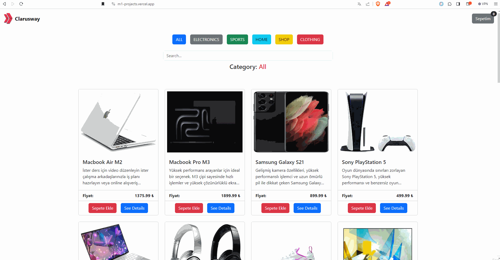

# Proje Ödevi: E-Ticaret Uygulaması Geliştirme - Kategori Filtreleme, Ürün Arama ve API Entegrasyonu

## Amaç
Bu ödevin amacı, Module 1 süresince öğrendiğiniz bilgileri uygulayıp Module 2: React için gerekli olan javascript bilgilerinizi pekiştirmek.

## Beklenen Çıktı


## Örnek Uygulama
[Shopping Projects](https://m1-projects.vercel.app/)

## Görevler

## Görev 1: HTML Yapısını Özümseme ve DOM Elementlerini Yakalama
**Açıklama:**
- Verilen HTML yapısını anlayınız(kendiniz de oluşturabilirsiniz).
- Bu yapıya uygun DOM elementlerini belirleyiniz ve belirlediğiniz elementleri yakalayınız.
<br>

    - [ ] HTML yapısını anladım ve DOM elementlerini başarıyla yakaladım.

## Görev 2: Ürünleri API'den Çekme Fonksiyonu Oluşturma
**Açıklama:**
- Belirtilen API adresinden ürünleri çekecek bir fonksiyon oluşturunuz.
- Sayfa yüklendiğinde bu fonksiyonu çağırınız.
<br>
    - [ ] API'den ürün çekme fonksiyonunu oluşturdum.
    - [ ] Sayfa yüklendiğinde fonksiyon başarıyla çalıştı.

## Görev 3: API'den Gelen Ürünleri Dinamik Olarak Gösterme
**Açıklama:**
- API'den gelen ürünleri dinamik bir şekilde ekrana yansıtınız.
- Ürün bilgilerini destructuring yöntemini kullanarak UI'ya yazdırınız.
<br>
    - [ ] API'den gelen ürünler başarıyla ekrana yansıtıldı.
    - [ ] Destructuring yöntemi kullanılarak ürün bilgileri ilgili elementlere yazdırıldı.

## Görev 4: Ürün Açıklama Bilgisini Kırpma ve Gösterme
**Açıklama:**
- Ürüne ait açıklama bilgisini belirli bir noktada kesiniz ve devamını "..." ile gösteriniz.
<br>
    - [ ] Ürün açıklama bilgisi belirli bir noktada kesilip "..." ile gösterildi.

## Görev 5: Category Bilgilerini Dinamik ve Unique Şekilde Toplama
**Açıklama:**
- API'den gelen ürün bilgileri içerisindeki her ürüne ait category bilgisini `reduce()` metodunu kullanarak dinamik ve unique bir şekilde bir array içerisinde toplayınız.(Manuel olarak kategori bilgilerini yazmayınız.)
- "all" değerini topladığınız array'e ekleyininiz.
<br>
    - [ ] Category bilgileri dinamik ve unique bir şekilde toplandı.
    - [ ] "all" değeri başarıyla eklendi.

## Görev 6: Category Bilgilerini UI'da Gösterme
**Açıklama:**
- Elde edilen category bilgilerini dinamik bir şekilde ilgili elementin içerisine yazdırınız.
<br>
    - [ ] Category bilgileri UI'da başarıyla gösterildi.

## Görev 7: Seçilen Category Bilgisini Ekrana Yazdırma
**Açıklama:**
- Seçilen category bilgisini ekrana yazdırınız.
<br>
    - [ ] Seçilen category bilgisi başarıyla ekrana yazdırıldı.

## Görev 8: Kategori Bilgisine Göre Filtreleme ve Ürün İsmine Göre Arama İşleminin Gerçekleştirilmesi
**Açıklama:**
- Kategori seçimi yapıldığında ilgili kategori bilgisine göre ekranda sergilen ürünler filtrelenebilmeli.
- Kullanıcı arama yapmak istediğinde sadece seçili olan kategori içerisinde arama yapabilmeli.
- Kategori seçimi sırasında filtreleme yapılırken input içerisinde bir değer varsa o değer de dikkate alınmalı.
| **Not:** Filtreleme işlemini ve arama işlemini hem seçilen category bilgisine hem de inputa yazılan değere göre gerçekleştirmeniz gerekiyor. 
<br>
    - [ ] Filtreleme işlemi başarıyla gerçekleşti.
    - [ ] Kullanıcı her değişiklik yaptığında arama işlemi başarıyla gerçekleşti.

## Görev 9: Sepete Ürün Ekleyebilme ve Sepetim Kısmında Sergileme
**Açıklama:**
- Sepete aktarılacak ürünleri saklamak için bir array oluşturunuz. Ürünler array içerisine API'den geldiği gibi arraye aktarılmalı.
- Sepetteki ürün kartlarında ürün resmi, ürün adı, miktarı  ve artırma-eksiltme-kaldırma butonları olsun. Ayrıca fiyat * miktar bilgisini de yazdırabilirsiniz. 
<br>
    - [ ] Sepete ürün eklemek için bir array oluşturuldu.
    - [ ] Array içerisindeki elemanlar bu UI kullanılarak sepetim kısmında ilgili elementin içine başarı ile yazıldı. 

## Görev 10: Sepete Ürün Ekleyebilme ve Miktarını Artırabilme
**Açıklama:**
- "Sepete Ekle" butonuna tıklandığında ilgili ürünü sepet arrayine aktarınız. Ardından bu arrayi kullanarak UI içerisine yazdırınız.
- Eğer ürün daha önce eklenmişse o ürünü yeni bir ürün olarak eklemeyiniz sadece o ürünün miktarını hem array içerisinde hemde UI içerisinde artırınız.
<br>
    - [ ] Ürün başarıyla sepet arrayine ekleniyor ve UI içerisine de yazdırılıyor.
    - [ ] Eğer ürün daha önce eklenmişse, başarılı bir şekilde miktarı hem array içerisinde hem de UI içerisinde artırılıyor.

## Görev 11: Sepet İçerisindeki Ürünlerin Toplam Fiyatını Hesaplama
**Açıklama:**
- Sepet içerisinde yer alan ürünlerin toplam fiyatını hesaplayınız ve sepet kısmında en altta gösteriniz.
<br>
    - [ ] Sepet içerisindeki ürünlerin toplam fiyatı başarıyla hesaplandı ve UI'da gösterildi.

## Görev 12: Sepet İçerisindeki Ürün Miktarını Güncelleme
**Açıklama:**
- Sepet içerisindeki ürün kartlarında yer alan artırma ve eksiltme butonlarına tıklandığında ilgili ürünün miktarını hem UI'da hem de sepet arrayinde güncelleyiniz.
<br>
    - [ ] Ürün miktarı başarıyla güncellendi hem UI'da hem de sepet arrayinde.

## Görev 13: Ürün Detaylarını Modalda Gösterme
**Açıklama:**
- "See Details" butonuna tıklandığında ilgili ürünü detaylı olarak açılan modalda sergileyiniz. Bunun için ilgili ürünün id bilgisini yakalayarak API adresine bu id ile birlikte istek atıp gelen responsu modal da sergileyebilirsiniz.
<br>
    - [ ] Ürün detayları başarıyla modalda gösterildi.

## Bonus Görev: Sepet Array'ini localStorage'da Saklama
**Açıklama:**
- Sepet array'ini localStorage'da saklayınız.
- Sayfa yenilendiğinde verilerin korunduğunu kontrol ediniz.
<br>
    - [ ] Sepet array'i başarıyla localStorage'da saklandı ve sayfa yenilendiğinde veriler korundu.
<hr>


## API Adresi
- Tüm ürünler için => https://anthonyfs.pythonanywhere.com/api/products/
- Tek bir ürün için = https://anthonyfs.pythonanywhere.com/api/products/{productID}


## Ek Notlar
- Verilen [templatei](./index.html) kullanabilirsiniz.
- Ürünler yüklenene kadar loading spinner ekleyebilirsiniz.
- Tasarım konusunda özgün tasarımlar oluşturabilirsiniz.
- Vite ile geliştirebilirsinz. Moduller ekleyebilirsiniz. Örneğin; ürün kartlarını yazdıran fonksiyonu ayrı bir js dosyasında tanımlayıp export edip ana dosyada kullanabilirsiniz.
- Kullanıcıyı notification kütüphaneleri kullanarak bilgilendirebilirsiniz. Ürün eklendi, kaldırıldı vb.
- Proje için bir repo oluşturunuz. Projeyi tamamlarken her aşama sonunda anlamlı mesajlar ile oluşturduğunuz repoya commitleyiniz.
- Modal-Offcanvas açma-kapatma ile ilgili paylaştığımız videoyu izleyebilirsiniz. [Videoyu izlemek için tıklayınız.](https://youtu.be/1KmmZPfLGuw)

## Örnek Dosya Yapısı
```
 ┣ 📂assets 
 ┃ ┗ 📜Clarusway_Logo.png
 ┣ 📜app.js
 ┣ 📜index.html
 ┣ 📜productUI.js
 ┣ 📜README.md
 ┣ 📜sepetUI.js
 ┗ 📜utils.js

// Vite 
 ┣ 📂src
 ┃ ┣ 📂assets
 ┃ ┃ ┗ 📜Clarusway_Logo.png
 ┃ ┣ 📜productUI.js
 ┃ ┣ 📜sepetUI.js
 ┃ ┗ 📜utils.js
 ┣ 📜.gitignore
 ┣ 📜index.html
 ┣ 📜main.js
 ┣ 📜package-lock.json
 ┗ 📜package.json
```

<center> <strong>🎗️🎗️Happy Coding!🎯🎯</strong> </center>
